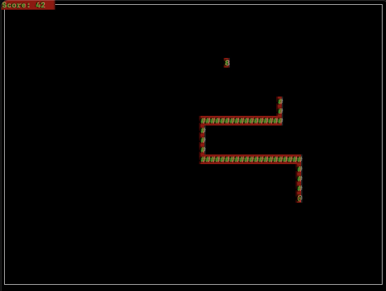

# Snake Game

## A collaboration between Sean Holmes and Mike Selkirk 

  ## Table of Contents
  * [Description](#description)
  * [Video Demo](#video-demo)
  * [Future Improvements](#future-improvements)
  * [License](#license)
  * [Questions?](#questions)

## Description
A collaborative snake game project written in C. Relies primarily on the curses/ncurses library for the gameplay mechanics and visuals. Press "q" to quit.

## Video Demo
https://www.youtube.com/watch?v=7rIhQJmWdVw

## Future Improvements
  * Adding multiple difficulty settings (i.e., modifying the correlation between score and speed over time)
  * Throwing in randomly generated obstacles that the player must avoid (currently the only obstacles causing death are the snake pit borders and the snake body itself)
  * Offering new themes
  * Installing sound effects and possibly background music
    

## License
Click the badge at the top of this README for more information on this particular license.

## Questions?
* Sean: https://github.com/holmesmainsend
* Mike: https://github.com/SoulTaker1623